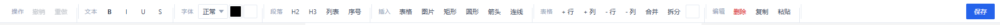
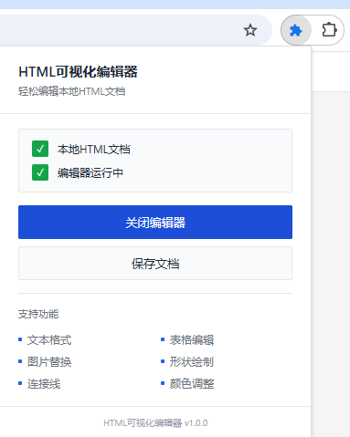
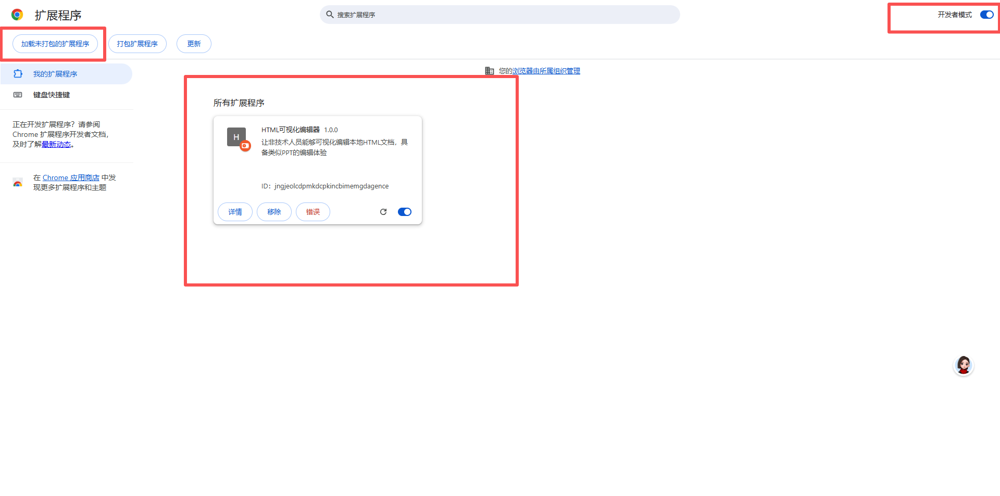
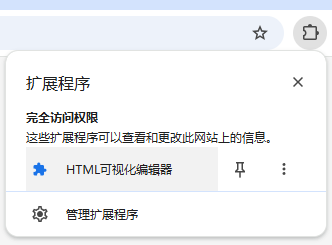

# HTML可视化编辑器

<p align="center">
  <strong>让非技术人员也能轻松编辑本地HTML文档的 Chrome 浏览器扩展</strong>
</p>

<p align="center">
  
</p>

---

## 一、产品简介

HTML可视化编辑器是一款 **Chrome 浏览器扩展插件**，专为需要编辑本地 HTML 文档但不懂代码的用户设计。它提供类似 PPT/Word 的**所见即所得（WYSIWYG）**编辑体验，无需了解任何前端技术，即可完成文本格式化、表格调整、形状绘制等操作。

### 核心亮点

- **零代码门槛** — 无需 HTML/CSS 基础，像用 Word 一样操作
- **本地运行** — 数据不离开你的电脑，隐私安全有保障
- **直接保存** — 使用 Chrome 原生文件 API，修改即时写入源文件
- **轻量无依赖** — 纯原生 JavaScript，无需安装任何框架或构建工具

---

## 二、效果预览

<!-- ==================== 截图区域 - 请替换以下占位符 ==================== -->

### 编辑器工具栏

<p align="center">
  
</p>

### Popup 弹窗面板

<p align="center">
  
</p>

<!-- ====================================================================== -->

---

## 三、功能特性总览

| 功能分类 | 具体能力 |
|----------|---------|
| **📝 文本格式** | 加粗、斜体、下划线、删除线、字体大小、文字颜色、背景色 |
| **📐 段落排版** | 标题级别 (H1-H6)、有序/无序列表、左中右对齐 |
| **📊 表格编辑** | 插入表格、增删行列、拖拽调宽高、单元格背景色、**合并/拆分单元格**、Excel 数据智能粘贴 |
| **🔷 形状绘制** | 矩形、圆形、圆角矩形、菱形、箭头、三角形、星形、六边形 |
| **🔗 连接线** | 贝塞尔曲线连接任意两个元素 |
| **🖼 图片管理** | 点击图片即可上传新图替换 |
| **💾 本地保存** | 一键保存，直接写入源文件（File System Access API） |

---

## 四、快速开始

### 环境要求

| 项目 | 要求 |
|------|------|
| 浏览器 | **Chrome 86+** 或 **Edge 86+** |
| 操作系统 | Windows / macOS / Linux |
| 文件类型 | 本地 `.html` / `.htm` 文件 (`file://` 协议) |

> [!NOTE]
> Firefox 和 Safari 暂不支持（缺少 File System Access API）

### 安装步骤

#### 开发者模式加载（推荐）

1. **下载本项目** 到本地

   ```bash
   git clone https://github.com/[你的用户名]/html-editor-extension.git
   ```

2. 打开 Chrome 浏览器，地址栏输入：

   ```
   chrome://extensions/
   ```

3. 开启右上角 **「开发者模式」** 开关

4. 点击 **「加载已解压的扩展程序」**

5. 选择本项目的根目录 `html-editor-extension`

6. ✅ 安装成功！浏览器工具栏会出现编辑器图标

<p align="center">
  
</p>

## 五、使用指南

### 5.1 启动编辑器

1. 在**文件管理器**中双击打开一个本地 `.html` 文件
2. 点击浏览器地址栏右侧的 **扩展图标**（拼图 🧩 图标）

   <p align="center"></p>

3. 在弹出窗口中确认显示 **「本地HTML文档 ✓」** 和 **「编辑器运行中 ✓」**
4. 点击 **「启动编辑器」** 或 **「关闭编辑器」** 按钮进行切换

### 5.2 文本编辑

- **直接编辑**：点击页面中的文字即可进入编辑模式
- **格式化文字**：先用鼠标选中文字，再点击工具栏上的格式按钮
- **字体大小**：选中文字后，通过字号下拉框调整（支持表格内字体调整）

### 5.3 表格操作

| 操作方式 | 说明 |
|----------|------|
| **单击单元格** | 选中该单元格，显示蓝色边框 |
| **拖拽选择** | 按住鼠标拖过多个单元格进行多选 |
| **拖拽边线** | 调整列宽或行高 |
| **右键 / 工具栏** | 插入/删除行列、合并/拆分单元格 |
| **Ctrl+V 粘贴** | 从 Excel 复制的数据会自动展开填充到表格中 |

### 5.4 插入形状与连接线

1. 在工具栏中选择形状类型（矩形、圆形、箭头等）
2. 在页面空白处**拖拽绘制**形状
3. 选择「连接线」工具后，依次点击两个元素即可连接

### 5.5 替换图片

1. 点击页面中的任意图片
2. 在弹出的文件选择对话框中选择新图片
3. 新图片会自动替换原图，保持原有尺寸比例

### 5.6 保存文档

编辑完成后有两种保存方式：

- **方式一**：点击弹窗中的 **「保存文档」** 按钮
- **方式二**：使用快捷键 `Ctrl+S`（如页面支持）

> [!IMPORTANT]
> 保存操作会**直接覆盖**原始 HTML 文件，建议提前备份。

---

## 六、项目结构

```
html-editor-extension/
├── manifest.json              # 扩展清单配置（MV3）
├── popup.html                 # 浏览器弹窗界面
├── popup.js                   # 弹窗逻辑（状态检测、启停控制）
├── README.md                  # 项目说明文档
├── Logo.png                   # 项目 Logo
├── 安装界面.png               # 截图：chrome://extensions 加载扩展
├── 功能清单.png               # 截图：编辑器工具栏全貌
├── 启动入口1.png              # 截图：扩展图标位置
├── 启动入口2.png              # 截图：popup 弹窗面板
├── test.html                  # 功能测试页面（双击即可体验编辑器）
├── content/                   # 内容脚本（核心逻辑）
│   ├── injector.js            # 入口：注入工具栏 + 全局事件调度
│   ├── styles/
│   │   ├── editor.css         # 交互样式（选中态、手柄、Toast）
│   │   ├── toolbar.css        # 浮动工具栏 UI
│   │   └── table.css          # 表格编辑专属样式
│   └── modules/
│       ├── table-resizer.js   # 表格拖拽调整
│       ├── shape-tool.js      # 形状绘制
│       └── connector.js       # 贝塞尔连接线
├── icons/
│   └── icon.svg               # 扩展图标（SVG）
└── lib/                       # 第三方依赖库
```

---

## 七、技术实现

| 技术点 | 方案说明 |
|--------|---------|
| **框架** | 原生 JavaScript，零依赖，无打包流程 |
| **扩展规范** | Manifest V3 |
| **编辑内核** | ContentEditable + execCommand + 自定义 DOM 操作 |
| **文件保存** | File System Access API (`window.showSaveFilePicker`) |
| **形状/连线** | SVG 动态绘制 + 绝对定位 |
| **DOM 监听** | MutationObserver 实现变化感知 |
| **样式架构** | CSS 变量统一管理配色体系（白 + 蓝简约风格） |
| **表格合并** | colspan / rowspan + 逻辑坐标 ↔ 物理坐标映射 |
| **智能粘贴** | Paste 事件捕获阶段拦截 + DOMParser 解析剪贴板 HTML |

---

## 八、开发计划

### 已完成 ✅

- [x] 基础文本格式化（加粗、斜体、颜色、字号等）
- [x] 段落排版（标题、列表、对齐）
- [x] 表格完整编辑（增删行列、拖拽调宽高、背景色）
- [x] 合并 / 拆分单元格
- [x] Excel 数据智能粘贴（自动展开填充）
- [x] 形状绘制（8 种基础形状）
- [x] 贝塞尔连接线
- [x] 图片替换上传
- [x] 容器复制粘贴（Canvas/SVG 快照保留）
- [x] 本地文件保存
- [x] 撤销 / 重做（Undo/Redo）

### 开发中 🚧

- [ ] 键盘快捷键体系
- [ ] 更多形状模板库

### 未来计划 📋

- [ ] 导出为 PDF / PNG
- [ ] 云端同步保存
- [ ] 多语言支持（i18n）
- [ ] Chrome Web Store 正式发布

---

## 九、常见问题（FAQ）

<details>
<summary><b>❌ 点击图标提示"不支持此页面"？</b></summary>

此扩展仅支持通过 **`file://` 协议**打开的本地 HTML 文件。请确保：
- 是在文件管理器中**双击**打开 `.html` 文件
- 不是在浏览器地址栏输入路径打开的

</details>

<details>
<summary><b>❌ 保存时弹出权限错误？</b></summary>

首次保存时会请求**文件读写授权**，请在弹出的系统对话框中点击「允许」。如果之前拒绝过，需要在 Chrome 设置中重置文件访问权限：
`设置 → 隐私和安全 → 网站设置 → 更多权限 → 文件系统访问`

</details>

<details>
<summary><b>❌ 从 Excel 粘贴数据变成了嵌套表格？</b></summary>

这是已修复的问题（v1.0.0+）。如果仍遇到请确保：
- 使用的是最新版本
- 先选中目标单元格，再 Ctrl+V 粘贴

</details>

<details>
<summary><b>❌ 表格里改字体大小没反应？</b></summary>

这也是已修复的问题。当前版本使用自定义 DOM 操作处理字体大小，支持：
- 多选单元格批量调整
- 单元格内部分文字调整
- 光标所在位置的实时调整

</details>

<details>
<summary><b>⌨️ 有哪些可用的快捷键？</b></summary>

| 快捷键 | 功能 |
|--------|------|
| `Ctrl + B` | 加粗 |
| `Ctrl + I` | 斜体 |
| `Ctrl + U` | 下划线 |
| `Ctrl + S` | 保存（需页面支持） |
| `Ctrl + C` | 复制容器 |
| `Ctrl + V` | 粘贴容器 |

更多快捷键正在规划中。

</details>

---

## 十、兼容性

| 浏览器 | 版本要求 | 支持情况 |
|--------|---------|---------|
| Google Chrome | 86+ | ✅ 完全支持 |
| Microsoft Edge | 86+ | ✅ 完全支持（Chromium 内核） |
| Brave | 86+ | ✅ 应该可用（未充分测试） |
| Opera | 86+ | ✅ 应该可用（未充分测试） |
| Firefox | — | ❌ 不支持（缺 File System Access API） |
| Safari | — | ❌ 不支持（不支持 Chrome 扩展） |

---

## 十一、参与贡献

欢迎提交 Issue 和 Pull Request！

### 如何参与

1. Fork 本仓库
2. 创建特性分支：`git checkout -b feature/新功能`
3. 提交改动：`git commit -m '添加某功能'`
4. 推送分支：`git push origin feature/新功能`
5. 提交 Pull Request

### 代码规范

- 使用 **2 空格缩进**
- 遵循现有 CSS 变量命名体系（`--pp-*`, `--tb-*` 等）
- 新增功能请在 `injector.js` 中保持模块化结构

---

## 十二、更新日志

### v1.0.0 （2025-01-15）

- 🎉 初始版本发布
- 基础文本编辑（格式化、字体、颜色、段落）
- 表格完整编辑（增删行列、拖拽调整、背景色）
- 合并 / 拆分单元格功能
- Excel 数据智能粘贴（自动展开填充到多格）
- 8种基础形状绘制 + 贝塞尔连接线
- 图片点击替换
- 容器复制粘贴（保留 Canvas/SVG 内容）
- 本地文件一键保存
- 白 + 蓝简约线条风格 UI 设计

---

## 许可证

[MIT License](LICENSE)

---

<p align="center">
  <sub>Made with ❤️ by <a href="https://github.com/zhenchuanyang8-glitch">老船</a></sub>
</p>
